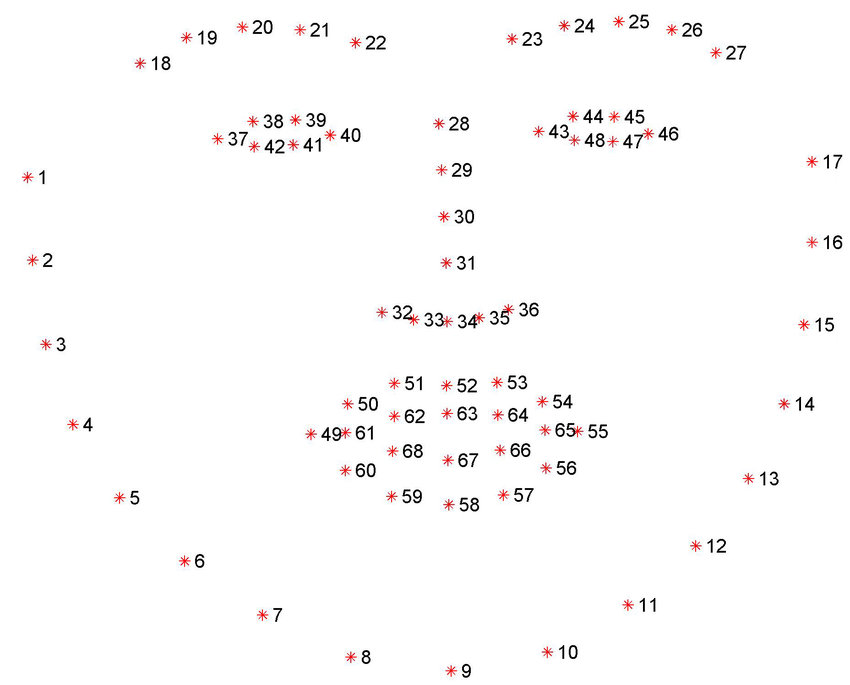

# Cubism Web Samples

Live2D Cubism 4 Editor で出力したモデルを表示するアプリケーションのサンプル実装です。

Cubism Web Framework および Live2D Cubism Core と組み合わせて使用します。

## What i changed
- Create my own character model and run with custom param
- Get face landmark using dlib with python
- Send face landmark data to socket.io server (Node.js)
- Use face x,y instead of mouse x,y


## How to calculate face X, Y?

### First, get total size of face for normalize face size.

In `lappmodel.ts` method `getBigBox`

```
    data[0].forEach(dot => {
      if (minX > dot.x) {
        minX = dot.x;
      }
      if (minY > dot.y) {
        minY = dot.y;
      }
      if (maxX < dot.x) {
        maxX = dot.x;
      }
      if (maxY < dot.y) {
        maxY = dot.y;
      }
    });
```
Get max x,y and min x,y for big size of face rect.

### Second, get normalized center of face.


In my case i used point `31` for center of x and `31, 34` for center of y.

```
    const gapVertical =
      bigBoxHeight - ((data[0][30].y + data[0][33].y) / 2 - bigBox.minY);
    const gapHorizontal = bigBoxWidth - (data[0][30].x - bigBox.minX);
```

It will return `0 ~ 1` but in cubism mouse's range is `-1 ~ 1`.

So, add some calc and threshold so that move face comfortable.
```
    regX = Number(((regX - 0.5) * 2 * 4 * -1).toFixed(2));
    regY = Number(((regY - 0.5) * 2 * 8).toFixed(2));
```

### Thrid, Smooth movement

If you use raw data of face position. It will move unnaturally.

```
    this._custDragX =
      this._custDragX + (this._custDragAnimX - this._custDragX) / 16;
    this._custDragY =
      this._custDragY + (this._custDragAnimY - this._custDragY) / 16;
```
It will reach for latest face x,y slowly.

## ライセンス

本 SDK を使用する前に、[ライセンス](LICENSE.md)をご確認ください。


## 注意事項

本 SDK を使用する前に、[注意事項](NOTICE.md)をご確認ください。


## ディレクトリ構成

```
.
├─ .vscode          # Visual Studio Code 用プロジェクト設定ディレクトリ
├─ Core             # Live2D Cubism Core が含まれるディレクトリ
├─ Framework        # レンダリングやアニメーション機能などのソースコードが含まれるディレクトリ
└─ Samples
   ├─ Resources     # モデルのファイルや画像などのリソースが含まれるディレクトリ
   └─ TypeScript    # TypeScript のサンプルプロジェクトが含まれるディレクトリ
```


## Live2D Cubism Core for Web

モデルをロードするためのライブラリです。

当リポジトリではCubism Coreを管理していません。
[こちら](https://www.live2d.com/download/cubism-sdk/download-web/)からCubism SDK for Webをダウンロードして、
Coreディレクトリのファイルをコピーしてください。


## 開発環境構築

1. [Node.js] と [Visual Studio Code] をインストールします
1. Visual Studio Code で **本 SDK のトップディレクトリ** を開き、推奨拡張機能をインストールします
    * ポップアップ通知の他、拡張機能タブから `@recommended` を入力することで確認できます

### サンプルデモの動作確認

コマンドパレット（*View > Command Palette...*）で `>Tasks: Run Task` を入力することで、タスク一覧が表示されます。

1. タスク一覧から　`npm: install - Samples/TypeScript/Demo` を選択して依存パッケージのダウンロードを行います
1. タスク一覧から `npm: build - Samples/TypeScript/Demo` を選択してサンプルデモのビルドを行います
1. タスク一覧から `npm: serve - Samples/TypeScript/Demo` を選択して動作確認用の簡易サーバを起動します
1. ブラウザの URL 欄に `http://localhost:5000/Samples/TypeScript/Demo/` と入力してアクセスします
1. コマンドパレットから `>Tasks: Terminate Task` を入力して `npm: serve` を選択すると簡易サーバが終了します

その他のタスクに関してはサンプルプロジェクトの [README.md](Samples/TypeScript/README.md) を参照ください。

NOTE: デバック用の設定は、`.vscode/tasks.json` に記述しています。

### プロジェクトのデバック

Visual Studio Code で **本 SDK のトップディレクトリ** を開き、 *F5* キーを入力すると Debugger for Chrome が起動します。

Visual Studio Code 上でブレイクポイントを貼って Chrome ブラウザと連動してデバックを行うことができます。

NOTE: デバック用の設定は、`.vscode/launch.json` に記述しています。


## SDKマニュアル

[Cubism SDK Manual](https://docs.live2d.com/cubism-sdk-manual/top/)


## 変更履歴

当リポジトリの変更履歴については [CHANGELOG.md](CHANGELOG.md) を参照ください。


## 開発環境

### Node.js

* 13.7.0
* 12.14.1
* 10.18.1


## 動作確認環境

| プラットフォーム | ブラウザ | バージョン |
| --- | --- | --- |
| Android | Google Chrome | 79.0.3945.136 |
| Android | Microsoft Edge | 42.0.4.3989 |
| Android | Mozilla Firefox | 68.2.0 |
| iOS / iPadOS | Google Chrome | 79.0.3945.73 |
| iOS / iPadOS | Microsoft Edge | 44.11.15 |
| iOS / iPadOS | Mozilla Firefox | 21.0 |
| iOS / iPadOS | Safari | 13.0.4 |
| Linux | Google Chrome | 79.0.3945.130 |
| Linux | Mozilla Firefox | 72.0.1 |
| macOS | Google Chrome | 79.0.3945.130 |
| macOS | Microsoft Edge | 79.0.309.71 |
| macOS | Mozilla Firefox | 72.0.2 |
| macOS | Safari | 13.0.4 |
| Windows | Google Chrome | 79.0.3945.130 |
| Windows | Internet Explorer 11 | 11.592.18362.0 |
| Windows | Microsoft Edge | 79.0.309.71 |
| Windows | Mozilla Firefox | 72.0.2 |

Note: 動作確認時のサーバの起動は `./Samples/TypeScript/Demo/package.json` の `serve` スクリプトを使用して行っています。
